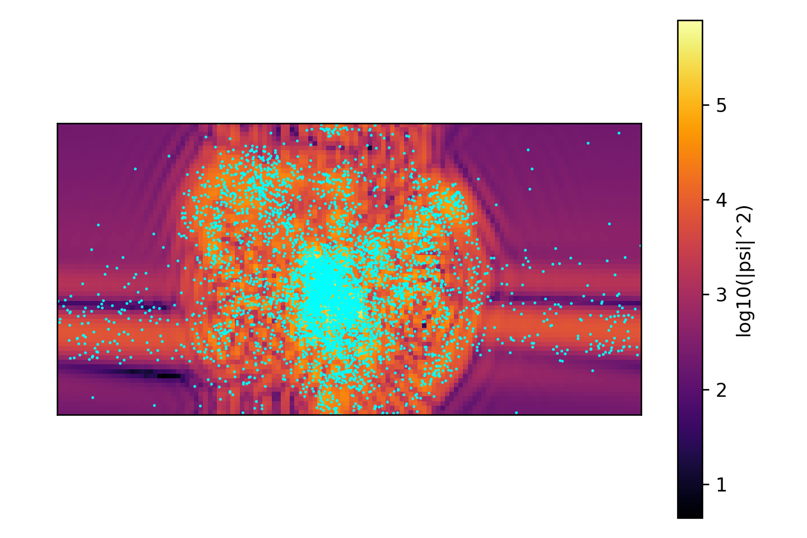

# quantum-jax

Authors: [Philip Mocz (@pmocz)](https://github.com/pmocz/), [Eric Ludwig (@TheRealEKL)](https://github.com/TheRealEKL)

(c) 2025

A simple differentiable Schrodinger-Poisson solver written in JAX

## How to Run (Locally)

Check out the code: 

```console
git clone git@github.com:pmocz/quantum-jax.git
```

Go into the folder:

```console
cd quantum-jax
```

Install dependencies:

```console
pip install -r requirements.txt
```

Run the simulation:

```console
python quantum-jax.py --show
```

## How to Run (On Rusty)

Check out the code: 

```console
git clone git@github.com:pmocz/quantum-jax.git
```

Go into the folder:

```console
cd quantum-jax
```

Make a virtual environment (make sure your `~/.bashrc` file contains `export VENVDIR=/mnt/home/USER_NAME/FOLDER_TO_YOUR_ENVIRONMENTS`) -- this is a one-time setup:

```console
module purge
module load python/3.11
python -m venv --system-site-packages $VENVDIR/quantum-jax-venv
source $VENVDIR/quantum-jax-venv/bin/activate
pip install --upgrade pip
pip install -r requirements.txt
```

(or just run the setup script: `.venv_setup.sh`)

Submit a job:

```console
sbatch quantum-jax.py
```

## Plot checkpoints

Plot the results by running the script:

```console
python plot_checkpoints.py
```

Below is an example of a snapshot from a simulation:


